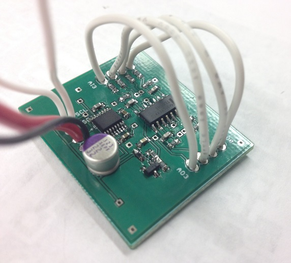

mightIO
=======

### What

The mightIO is an analog IO board capable of inputting and outputting voltages from -10V to +10V off of a +5V power supply, across four channels, without any external components.

### Why

The mightIO aims to solve the problem "I want to easily read or write analog voltages, in a wide range, decently fast, cheap, and with pretty good accuracy".

Every time I tell my fellow scientists about the Arduino, the first question they ask is "does it have analog outputs?" and I have a tough time explaining why the Arduino can't do it, but also why there aren't any straightforward shields that can do it.

There are shields for all sorts of crazy things, but it seems that analog output shields fall into two categories, either buffered audio output or voltage-limited DAC (eg. less than 0-5V). It's certainly possible to rig up split-rail power supplies and an opamp circuit, but that gets bulky and complicated quickly. 

My philosophy for using Arduino to save time is to "go from working to working", in other words, to be able to make incremental changes keeping everything functional, and this board embodies that much better than having to build I2C DAC + opamp combos from scratch every time.

### How

The +10V and -10V rails are generated using a MAX864 capacitive doubler/inverter chip, running at 180 kHz. The ADC is a MAX11612 and the DAC is a MCP4728, both 12-bit 4-channel I2C chips with range 0V-4.096V. The voltage scaling is performed using two quad TL064 low-power op-amps. The only connections to the Arduino board are +5V, GND, SDA, and SCL. In addition to the 4 inputs and 4 outputs, there is a +10V/GND/-10V breakout.

### Specs

All relevant numbers below are based on actual measurements.
* Footprint: 1.5 in x 1.25 in
* Est. materials cost: $8.90
* Voltage range: 2x Vin, minus about 0.6V droop
* Channels: 4 in, 4 out
* Noise: 40 mV pk-pk, <10 mV RMS (<0.1% noise)
* Resolution: 9 bits raw, 11 bits software median-filtered (<0.1% error)
* Power consumption: 20 mA (no load)
* Maximum effective output load: ~50 mA (3V droop)
* Output impedance: 50 ohms (<1.0V droop @ 1k load)
* Max # of devices: Up to 4 (but I2C addresses need to be reprogrammed) 

### Pricing

The BOM can be found in the repository under "Hardware" - unit cost is estimated at around $8.90 for a run of 1000, of which the ADC, DAC, and doubler each make up about 20%, respectively. This could probably be reduced by about 10% through careful tweaking of the part sourcing/values. Features could also be reduced (fewer channels, removing ADC), but I think the cost overhead is low enough that anyone wanting just an ADC or just a DAC would still buy the board.

I've heard that the retail markup is around 2x, so say the board sells for around $15-$20 - that's cheaper than or comparable to pretty much any other ADC -or- DAC solution out there, with the exception of the much more limited MCP4725 breakout.

### Market

The market for this is anyone that is using Arduinos to interface with a wide range of external devices/sensors/etc that require larger voltage inputs or outputs to function. The key is that it should be priced competitively enough that anyone looking for either a DAC or ADC would consider the board as the simplest and cheapest option.

### Software

The library isn't finished, but the basic parts are all there, just needs some other handy functions and examples. Other features I plan to add are getting the ADC set up in differential input mode to try low-noise measurements and a median-filtered analogRead.

### Who

[Tamas Szalay](http://tamas-szalay.squarespace.com/), full-time Applied Physics grad student and part-time hacker, Arduino afficionado
